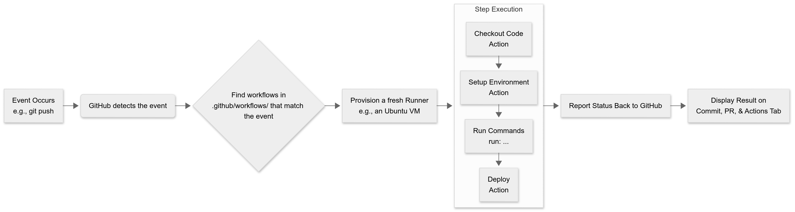

# GitHub Actions Learning Guide
### 

### The Core Concept: Event-Driven Automation

At its heart, GitHub Actions is an **event-driven platform**. You define workflows that sit and wait for something to happen (an **event**). When that event occurs, GitHub springs into action and runs your workflow.

---

### The 5-Step Process: How It Works in Practice

Here’s the journey of a GitHub Action, step-by-step:

#### 1. Event (The Trigger)
Everything starts with an **event**. This is something that happens in your repository. Common events include:
*   `push`: Code is pushed to a branch.
*   `pull_request`: A pull request is opened, updated, or merged.
*   `issue_comment`: A comment is created on an issue.
*   `schedule`: A specific time is reached (e.g., a nightly build).
*   `workflow_dispatch`: A user manually triggers the workflow from the UI.

**Example:** You push your code to the `main` branch. This is the `push` event.

#### 2. Trigger the Workflow
GitHub's systems detect the event. They immediately check the `.github/workflows/` directory in your repository for any YAML files that are listening for that specific event.

**Example:** Your `ci.yml` file has `on: push: branches: [ main ]`. It's a match! GitHub grabs this workflow file.

#### 3. Provision the Runner
GitHub now needs a clean, isolated machine to run your jobs on. This machine is called a **runner**.
*   **GitHub-Hosted Runners:** Free, managed virtual machines provided by GitHub (e.g., `ubuntu-latest`, `windows-latest`).
*   **Self-Hosted Runners:** Machines you set up and manage yourself (useful for specific hardware or software needs).

GitHub spins up a fresh runner (e.g., a new Ubuntu VM) and prepares it.

#### 4. Execute the Jobs and Steps
The runner now executes your workflow, job by job, step by step.

*   **Job:** A set of steps that runs on the *same runner*. Jobs run in parallel by default.
*   **Step:** An individual task. A step can either:
    1.  **Run a shell command** (e.g., `npm install`, `echo "Hello!"`).
    2.  **Use an Action** (a reusable unit of code).

**This is the key to its power.** The runner performs a series of actions like:
1.  **Checkout:** The first step is almost always `uses: actions/checkout@v4`. This is a pre-built action that copies your repository's code from GitHub onto the runner so it can work with it.
2.  **Set Up Environment:** A step like `uses: actions/setup-node@v4` to install Node.js on the runner.
3.  **Run Your Scripts:** Steps that execute your commands, like `run: npm ci` (install dependencies) and `run: npm test` (run your test suite).

```yaml
jobs:
  build-and-test:
    runs-on: ubuntu-latest
    steps:
      - name: Checkout code       # Action: Gets the code
        uses: actions/checkout@v4

      - name: Setup Node.js       # Action: Installs Node
        uses: actions/setup-node@v4
        with:
          node-version: '20'

      - name: Install dependencies # Shell command
        run: npm ci

      - name: Run tests           # Shell command
        run: npm test
```

#### 5. Report Back
As each step runs, it reports its status back to GitHub.
*   **Success (0 exit code):** The step passes, and the workflow moves to the next one.
*   **Failure (Non-zero exit code):** The step fails. The entire job fails, and depending on your settings, the workflow might stop.

The final status of the workflow (✅ success or ❌ failure) is displayed prominently in your repository's "Actions" tab, on the commit, and on the pull request.

---

### Key Terminology Summary

| Term         | What it is                                               | Real-World Analogy                                           |
| :----------- | :------------------------------------------------------- | :----------------------------------------------------------- |
| **Event**    | The trigger that starts the workflow.                    | A doorbell ringing.                                          |
| **Workflow** | The entire automated process (defined in a `.yml` file). | The plan you follow when the doorbell rings (e.g., get door, greet person, accept package). |
| **Job**      | A set of steps that runs on a single runner.             | A single task in the plan, like "accept package."            |
| **Step**     | An individual task in a job.                             | A single action within the task, like "open door" or "say hello." |
| **Action**   | A reusable, pre-packaged step.                           | Using a pre-written recipe for "how to greet someone" instead of figuring it out yourself. |
| **Runner**   | The server/machine that executes the jobs.               | The person who carries out the plan.                         |

### Why This is Powerful

1.  **Automation:** No more manual `npm test` or `git push` to production. It happens automatically.
2.  **Fast Feedback:** You see if your code breaks something immediately in the pull request, **before** it gets merged.
3.  **Consistency:** Every commit is built and tested in an identical, clean environment. No more "but it worked on my machine!"
4.  **Ecosystem:** You can use thousands of pre-built Actions from the [GitHub Marketplace](https://github.com/marketplace?type=actions) to do almost anything, from deploying to AWS to sending a Slack notification.

## 📚 Complete Learning Resources

### Official Documentation
- [GitHub Actions Official Docs](https://docs.github.com/en/actions)
- [Quickstart Guide](https://docs.github.com/en/actions/quickstart)
- [Workflow Syntax Reference](https://docs.github.com/en/actions/reference/workflow-syntax-for-github-actions)

### Tutorials & Courses
- [GitHub Skills: Actions](https://skills.github.com/)
- [YouTube: GitHub Actions Beginner Tutorial](https://www.youtube.com/watch?v=R8_veQiYBjI)
- [GitHub Learning Lab](https://lab.github.com/)

### Community & Examples
- [GitHub Actions Marketplace](https://github.com/marketplace?type=actions)
- [Awesome Actions](https://github.com/sdras/awesome-actions)
- [GitHub Community Forum](https://github.com/community/community)

## 🚀 Your YAML Workflow Explained

Here's a breakdown of the workflow you created:

### Workflow Structure

```yaml
name: Database Data Fetcher
```
**Purpose**: Names your workflow for easy identification in the Actions tab.

### Trigger Events
```yaml
on:
  push:
  schedule:
    - cron: "*/5 * * * *"
  workflow_dispatch:
    inputs:
      MySQL:
        description: "Fetch from MySQL"
        required: false
        type: boolean
        default: false
      PostgreSQL:
        description: "Fetch from PostgreSQL"
        required: false
        type: boolean
        default: false
```

**Explanation**:
- `push`: Triggers on any push to the repository
- `schedule`: Uses cron syntax to run every 5 minutes
- `workflow_dispatch`: Allows manual triggering with custom inputs (MySQL and PostgreSQL checkboxes)

### Job Definition
```yaml
jobs:
  fetch-data:
    runs-on: ubuntu-latest
```

**Explanation**:
- Defines a job named "fetch-data"
- `runs-on: ubuntu-latest`: Specifies the operating system for the runner

### Steps Breakdown

#### Step 1: MySQL Fetch
```yaml
- name: MySQL fetch
  if: ${{ github.event.inputs.MySQL == 'true' }}
  run: echo "I will retrieve data from MySQL"
```

**What it does**:
- Only runs if the MySQL checkbox was selected during manual trigger
- Demonstrates conditional execution with `if` statement
- Uses `echo` command to simulate a database fetch

#### Step 2: PostgreSQL Fetch
```yaml
- name: PostgreSQL fetch
  if: ${{ github.event.inputs.PostgreSQL == 'true' }}
  run: echo "I will retrieve data from PostgreSQL."
```

**What it does**:
- Conditional execution based on PostgreSQL input
- Simulates PostgreSQL data retrieval

#### Step 3: Completion Message
```yaml
- name: Done
  run: echo "You did it 😎"
```

**What it does**:
- Always executes (no conditions)
- Provides positive feedback

#### Step 4: Logging Information
```yaml
- name: Some Log properties
  run: |
    echo "The name of event is = ${{ github.event_name }}"
    echo "Commit SHA is = ${{ github.sha }}"
    echo "Runner OS is = ${{ runner.os }}"
```

**What it does**:
- Demonstrates multi-line commands with the `|` character
- Accesses GitHub context variables:
  - `github.event_name`: Type of event that triggered the workflow
  - `github.sha`: Commit SHA that triggered the workflow
  - `runner.os`: Operating system of the runner

## 🎯 Learning Path Recommendations

1. **Start with basics**: Modify the echo commands to understand workflow execution
2. **Experiment with triggers**: Try different events like `pull_request` or `issues`
3. **Add real actions**: Replace echo commands with actual database operations
4. **Explore artifacts**: Learn to save and share files between jobs
5. **Set up environments**: Practice with staging/production environments
6. **Implement secrets**: Learn to use GitHub Secrets for sensitive data

## 💡 Next Steps to Try

1. Add a step that fails intentionally to see error handling
2. Create a second job that depends on this one using `needs`
3. Add a matrix strategy to run on multiple OS versions
4. Implement caching to speed up your workflow
5. Set up notifications on success/failure

## 📋 Example Enhancement

Here's how you could expand your workflow:

```yaml
- name: Upload log artifact
  if: always()  # Runs even if previous steps fail
  uses: actions/upload-artifact@v3
  with:
    name: execution-log
    path: # You would specify log files here
```

# GitHub Actions for Data Engineers

## What are GitHub Actions?

GitHub Actions is a **continuous integration and continuous delivery (CI/CD) platform** that allows you to automate your build, test, and deployment pipeline. You can create workflows that build and test every pull request to your repository or deploy merged pull requests to production.

## Key Components

1. **Workflows**: Automated procedures you add to your repository
2. **Events**: Specific activities that trigger workflows (pushes, PRs, schedules)
3. **Jobs**: Sets of steps that execute on the same runner
4. **Steps**: Individual tasks that can run commands or actions
5. **Actions**: Standalone commands that are combined into steps
6. **Runners**: Servers that run your workflows when triggered

## How GitHub Actions Help Data Engineers

### 1. **Automated Data Pipeline Orchestration**
```yaml
name: Daily ETL Pipeline
on:
  schedule:
    - cron: '0 2 * * *'  # Run at 2 AM daily
  workflow_dispatch:

jobs:
  extract-transform:
    runs-on: ubuntu-latest
    steps:
    - name: Checkout code
      uses: actions/checkout@v3
      
    - name: Set up Python
      uses: actions/setup-python@v4
      with:
        python-version: '3.9'
        
    - name: Run ETL script
      run: python scripts/etl_pipeline.py
      
    - name: Upload processed data
      uses: actions/upload-artifact@v3
      with:
        name: processed-data
        path: output/
```

### 2. **Data Quality Testing**
```yaml
name: Data Quality Checks
on: [pull_request]

jobs:
  data-quality:
    runs-on: ubuntu-latest
    steps:
    - name: Checkout code
      uses: actions/checkout@v3
      
    - name: Run data validation tests
      run: python tests/validate_data_quality.py
      
    - name: Check schema compliance
      run: python tests/validate_schema.py
```

### 3. **Environment-Specific Deployments**
```yaml
name: Deploy to Environment
on:
  workflow_dispatch:
    inputs:
      environment:
        description: 'Target environment'
        required: true
        default: 'staging'
        type: choice
        options:
        - staging
        - production

jobs:
  deploy:
    runs-on: ubuntu-latest
    steps:
    - name: Deploy to ${{ github.event.inputs.environment }}
      run: |
        echo "Deploying to ${{ github.event.inputs.environment }} environment"
        # Your deployment scripts here
```

## Real-World Use Cases for Data Engineers

### 1. **Automated Data Processing Pipelines**
- Schedule daily/weekly data ingestion and transformation
- Process data immediately when new files arrive in storage
- Trigger data quality checks after processing

### 2. **Infrastructure as Code (IaC)**
```yaml
name: Deploy Data Infrastructure
on:
  push:
    branches: [ main ]
    paths: [ 'terraform/**' ]

jobs:
  terraform:
    runs-on: ubuntu-latest
    steps:
    - name: Checkout
      uses: actions/checkout@v3
      
    - name: Setup Terraform
      uses: hashicorp/setup-terraform@v2
      
    - name: Terraform Plan
      run: terraform plan -out=tfplan
      
    - name: Terraform Apply
      if: github.ref == 'refs/heads/main'
      run: terraform apply tfplan
```

### 3. **Data Testing and Validation**
- Run data quality tests on pull requests
- Validate schema changes before merging
- Test data transformation logic

### 4. **Containerized Data Applications**
```yaml
name: Build and Push Data App Container
on:
  push:
    branches: [ main ]

jobs:
  build-and-push:
    runs-on: ubuntu-latest
    steps:
    - name: Checkout code
      uses: actions/checkout@v3
      
    - name: Build Docker image
      run: docker build -t data-app:latest .
      
    - name: Push to container registry
      run: |
        echo "${{ secrets.DOCKER_PASSWORD }}" | docker login -u "${{ secrets.DOCKER_USERNAME }}" --password-stdin
        docker push data-app:latest
```

### 5. **Scheduled Data Reports**
```yaml
name: Generate Daily Reports
on:
  schedule:
    - cron: '0 6 * * *'  # 6 AM daily
  workflow_dispatch:

jobs:
  generate-reports:
    runs-on: ubuntu-latest
    steps:
    - name: Generate sales report
      run: python reports/daily_sales.py
      
    - name: Send email report
      uses: dawidd6/action-send-mail@v3
      with:
        server_address: smtp.gmail.com
        server_port: 465
        username: ${{ secrets.MAIL_USERNAME }}
        password: ${{ secrets.MAIL_PASSWORD }}
        subject: Daily Sales Report
        to: data-team@company.com
        from: GitHub Actions
        body: reports/sales_report.html
```

## Benefits for Data Engineering

1. **Automation**: Reduce manual tasks in data pipelines
2. **Reproducibility**: Ensure consistent environment and execution
3. **Collaboration**: Coordinate work across data team members
4. **Monitoring**: Get notifications for pipeline failures
5. **Cost Efficiency**: Only run workloads when needed
6. **Scalability**: Handle variable workloads with matrix strategies

## Getting Started as a Data Engineer

1. **Start simple**: Automate your data quality checks
2. **Add scheduling**: Set up regular data processing jobs
3. **Implement environments**: Create staging/production workflows
4. **Add notifications**: Get alerts for failures
5. **Optimize**: Use caching and matrix strategies for efficiency

## Learning Resources Specific to Data Engineering

- [Data Engineering with GitHub Actions](https://github.com/solutions/data-engineering-with-actions)
- [Building Data Pipelines with Actions](https://docs.github.com/en/actions/guides/building-data-pipelines)
- [Terraform with GitHub Actions for Data Infrastructure](https://learn.hashicorp.com/tutorials/terraform/github-actions)

GitHub Actions provides data engineers with a powerful, flexible platform to automate the entire data lifecycle from ingestion to deployment, all within the same ecosystem where code is stored and collaborated on.
